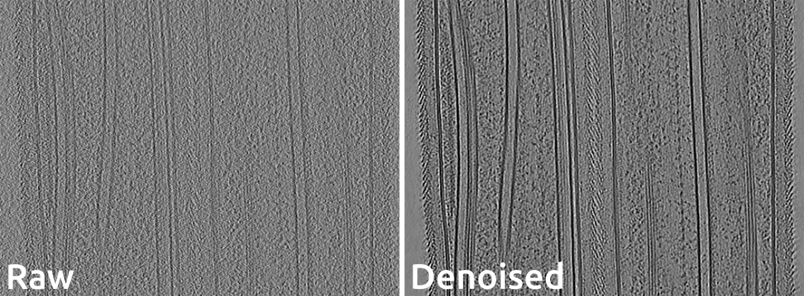

# Cryo-CARE: Content-Aware Image Restoration for Cryo-Transmission Electron Microscopy Data
Tim-Oliver Buchholz<sup>1</sup>, Mareike Jordan, Gaia Pigino, Florian Jug</br>
<sup>1</sup><code>tibuch@mpi-cbg.de</code>

Multiple approaches to use deep learning for image restoration have recently been proposed. Training such approaches requires well registered pairs of high and low quality images. While this is easily achievable for many imaging modalities, e.g. fluorescence light microscopy, for others it is not. Cryo-transmission electron microscopy (cryo-TEM) could profoundly benefit from improved denoising methods, unfortunately it is one of the latter. Here we show how recent advances in network training for image restoration tasks, i.e. denoising, can be applied to cryo-TEM data. We describe our proposed method and show how it can be applied to single cryo-TEM projections and whole cryo-tomographic image volumes. Our proposed restoration method dramatically increases contrast in cryo-TEM images, which improves the interpretability of the acquired data. Furthermore we show that automated downstream processing on restored image data, demonstrated on a dense segmentation task, leads to improved results. 

Publications:
* [arXiv](https://arxiv.org/abs/1810.05420)
* [ISBI19](https://ieeexplore.ieee.org/stamp/stamp.jsp?arnumber=8759519)
* [Book Chapter](https://doi.org/10.1016/bs.mcb.2019.05.001)

This is the implementation of the Tomo2Tomo denoising scheme for direct-detector movie acquisitions.

__Note:__ A memory efficient implementation can be found [here](https://github.com/juglab/cryoCARE_pip).

## Usage
### Prerequisits:
* NVIDIA GPU with driver >= 430.40
---
### Installation with Singularity
First step is to clone this github repository.

Then the simplest way to run the examples is to use the [Singularity](https://sylabs.io/docs/) container. Singularity allows us to provied you with a fully configured environment, which has all needed packages and dependecies installed. But it requires you to install Singularity on your system:

* [Install on Linux](https://sylabs.io/guides/3.3/user-guide/installation.html#install-on-linux)
* [Install on Mac](https://sylabs.io/guides/3.3/user-guide/installation.html#install-on-windows-or-mac)
* [Install on Windows](https://sylabs.io/guides/3.3/user-guide/installation.html#install-on-windows-or-mac)

Once you have installed Singularity you can either build the container yourself with the following commands:
1. Change direcotry into the cloned repository:</br>
`$ cd cryoCARE_T2T`
2. Run the Singularity build:</br>
`$ sudo singularity build cryoCARE_v0.1.1.simg cryoCARE.Singularity`

#### MotionCor2
Due to licensing we can not ship MotionCor2 directly with the singularity container. You have to download `MotionCor2 v1.3.0 CUDA-10.1` from [here](https://msg.ucsf.edu/software) and place it in `cryoCARE_T2T/example`. 

__Note__: It is important to get the CUDA-10.1 version, since we specifically installed CUDA-10.1 in the singularity container.

### Example Data
We would like to thank Mareike Jordan from the [Pigino Lab](https://www.mpi-cbg.de/research-groups/current-groups/gaia-pigino/research-focus/) at [MPI-CBG](https://www.mpi-cbg.de) for the example data.

The data can be downloaded [here](https://cloud.mpi-cbg.de/index.php/s/prTOcYsFfPNa1mG/download).

Once the data is downloaded unpack it into `cryoCARE_T2T/example/data/`. 

You should now have the following directory tree:
```
cryo_CARE_T2T
|   └─── example
|           └─── data
|           |       └─── Tomo110
|           |               └─── frames
|           |               └─── imod
|           |--- MotionCor2 v1.3.0 CUDA-10.1
```

### Run the Singularity Image
To start a `jupyter notebook` from the singularity image run this command:</br>
`$ singularity run --nv -B user:/run/user -B example/:/notebooks -B example/data/:/data cryoCARE_v0.1.1.simg`

This will display a link to the running jupyter server. Open this link in a browser and you will be able to run the five example notebooks in 'cryoCARE_simg/example':
* `01_Split_Frames.ipynb`: This notebook aligns and splits the movie frames into even/odd halves.
* `02_Tomogram_Reconstruction.ipynb`: This notebook reconstructs the two (even/odd) tomograms based on a previous IMOD-reconstruction.
* `03_Training_Data_Generation.ipynb`: This notebook is used to extract training and validation data.
* `04_Train_cryoCARE_Network.ipynb`: This notebook shows how a cryo-CARE network is trained.
* `05_Predict_cryoCARE.ipynb`: The last notebook is used to apply a trained model to tomographic data.

---
### Manual Installation
You can also install the packages on your own:
* [MotionCor2 v1.3.0 CUDA-10.1](https://msg.ucsf.edu/software)
* [IMOD v4.10.16 (beta-release)](http://bio3d.colorado.edu/ftp/latestIMOD/)
* [CUDA-10.1 for MotionCor2](https://developer.nvidia.com/cuda-10.1-download-archive-base)
* [CUDA-10.0 for Tensorflow](https://developer.nvidia.com/cuda-10.0-download-archive)
* [Tensorflow 1.15](https://www.tensorflow.org/install) `$ pip install tensorflow-gpu==1.15`
* [csbdeep](https://github.com/csbdeep/csbdeep) `$ pip install csbdeep`
* [mrcfile](https://pypi.org/project/mrcfile/) `$ pip install mrcfile`
* [jupyter](https://pypi.org/project/jupyter/) `$ pip install jupyter`

__Note__: If you run it without the Singularity container you probably have to adjust the paths inside the jupyter notebooks.

---
## How to cite:
```
@inproceedings{buchholz2019cryo,
  title={Cryo-CARE: content-aware image restoration for cryo-transmission electron microscopy data},
  author={Buchholz, Tim-Oliver and Jordan, Mareike and Pigino, Gaia and Jug, Florian},
  booktitle={2019 IEEE 16th International Symposium on Biomedical Imaging (ISBI 2019)},
  pages={502--506},
  year={2019},
  organization={IEEE}
}

@article{buchholz2019content,
  title={Content-aware image restoration for electron microscopy.},
  author={Buchholz, Tim-Oliver and Krull, Alexander and Shahidi, R{\'e}za and Pigino, Gaia and J{\'e}kely, G{\'a}sp{\'a}r and Jug, Florian},
  journal={Methods in cell biology},
  volume={152},
  pages={277--289},
  year={2019}
}
```
